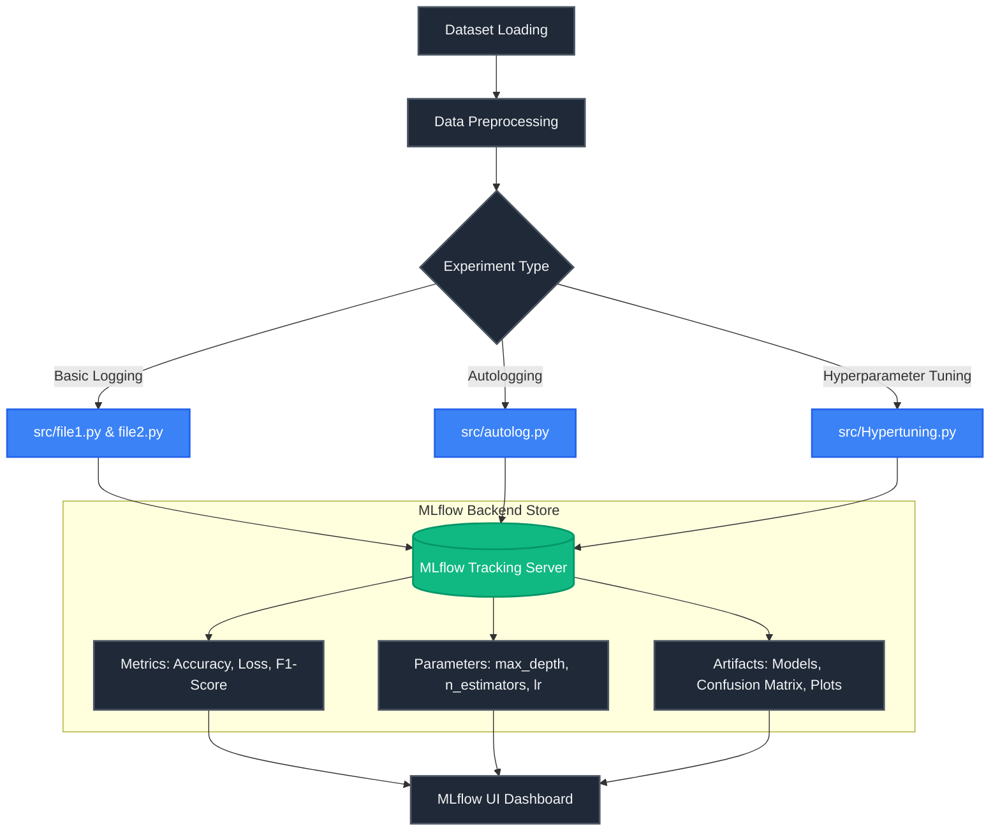

<div align="center">
  <h1>🚀 MLflow Experiments Tracking Demo</h1>
  <p><em>A comprehensive, production-ready demonstration of machine learning experiment tracking, hyperparameter tuning, and model logging using MLflow.</em></p>
  
  [](https://www.python.org/)
  [](https://mlflow.org/)
  [](https://scikit-learn.org/)
  [](LICENSE)
</div>

---

## 📖 Overview

Welcome to the **MLflow Experiments Tracking Demo**. This repository serves as a practical, hands-on guide to integrating [MLflow](https://mlflow.org/) into your machine learning workflows. Tracking experiments is a critical component of MLOps, enabling data scientists and engineers to log parameters, code versions, metrics, and output files to ensure reproducibility and scalability.

Whether you are performing basic metric logging, utilizing automatic logging (autologging), or conducting extensive hyperparameter tuning, this project demonstrates industry best practices for organizing and tracking your ML experiments.

## 🏗️ Architecture & Flow

The following diagram illustrates the end-to-end workflow of the experiments in this repository, detailing how data flows from preprocessing to the MLflow Tracking Server.



## 📂 Repository Structure

```text
MLFLOW-experiments/
├── src/
│   ├── file1.py          # Basic MLflow tracking example (Manual Logging)
│   ├── file2.py          # Additional basic tracking demonstration
│   ├── autolog.py        # Demonstration of mlflow.autolog() capabilities
│   └── Hypertuning.py    # Hyperparameter tuning with nested MLflow runs
├── mlflow.db             # SQLite database for MLflow backend store
├── Confusion-matrix.png  # Sample artifact generated during runs
├── mlflow_autolog.txt    # Documentation on autologging capabilities & limitations
├── mlflowbasic.txt       # Documentation on basic MLflow tracking features
├── .gitignore            # Git ignore rules
├── LICENSE               # MIT License
└── README.md             # Project documentation
```

## ✨ Core Features

### 1. Basic Manual Logging (`src/file1.py`, `src/file2.py`)
Learn the fundamentals of MLflow tracking. These scripts demonstrate how to manually log:
- **Parameters**: Learning rate, max depth, batch size.
- **Metrics**: Accuracy, Loss, Precision, Recall, F1-Score.
- **Artifacts**: Saving visualizations like `Confusion-matrix.png` and pickled models directly to the tracking server.

### 2. Automatic Logging (`src/autolog.py`)
Eliminate boilerplate code using `mlflow.autolog()`. This script showcases how MLflow can automatically infer and log:
- Framework-specific hyperparameters (e.g., scikit-learn model parameters).
- Evaluation metrics (accuracy, precision, recall).
- Model signatures and the trained model itself.
*(Note: Custom metrics and complex intermediate states still require manual logging, as detailed in `mlflow_autolog.txt`)*.

### 3. Hyperparameter Tuning (`src/Hypertuning.py`)
Track complex optimization workflows. This module demonstrates:
- Running multiple iterations of model training.
- Logging different hyperparameter combinations.
- Comparing runs within the MLflow UI to identify the optimal model configuration.

## 🚀 Getting Started

### 1. Prerequisites
Ensure you have Python 3.8 or higher installed. It is recommended to use a virtual environment.

```bash
# Create and activate a virtual environment
python -m venv venv
source venv/bin/activate  # On Windows use: venv\Scripts\activate

# Install required dependencies
pip install mlflow scikit-learn pandas numpy matplotlib
```

### 2. Launch the MLflow Tracking Server
To view your experiments, start the MLflow tracking server. This project uses a local SQLite database (`mlflow.db`) as the backend store.

```bash
mlflow ui --backend-store-uri sqlite:///mlflow.db
```
Navigate to [http://localhost:5000](http://localhost:5000) in your web browser to access the MLflow dashboard.

### 3. Execute Experiments
Open a new terminal window (ensure your virtual environment is activated) and run the experiment scripts:

```bash
# Run basic manual logging
python src/file1.py
python src/file2.py

# Run the autologging demonstration
python src/autolog.py

# Execute hyperparameter tuning runs
python src/Hypertuning.py
```

## 📊 What Can Be Tracked?

Based on the provided documentation (`mlflowbasic.txt`), MLflow is highly versatile. You can track:
- **Metrics**: Accuracy, Loss, AUC, Custom Metrics (RMSE, MAE).
- **Parameters**: Model hyperparameters, data processing ratios, feature engineering criteria.
- **Artifacts**: Trained models (Pickle, ONNX), confusion matrices, ROC curves, input datasets, and environment files (`requirements.txt`, `conda.yaml`).
- **Metadata**: Run IDs, experiment names, timestamps, Git commit hashes, and custom tags (e.g., `gpu`, `cloud_provider`).

## 🤝 Contributing
Contributions, issues, and feature requests are welcome! Feel free to check the [issues page](https://github.com/Rupeshbhardwaj002/MLFLOW-experiments/issues).

## 📄 License
This project is licensed under the MIT License - see the [LICENSE](LICENSE) file for details.
